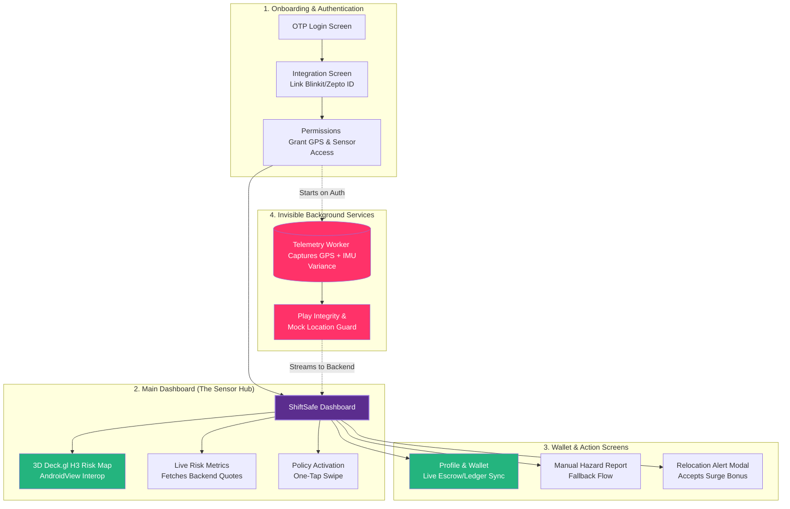
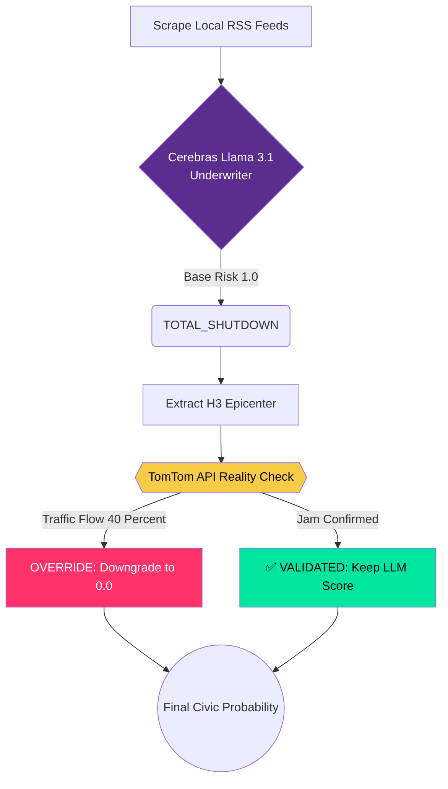
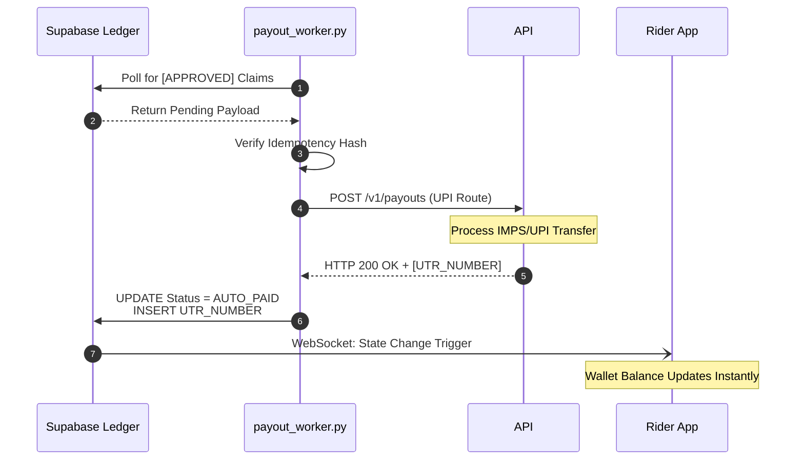
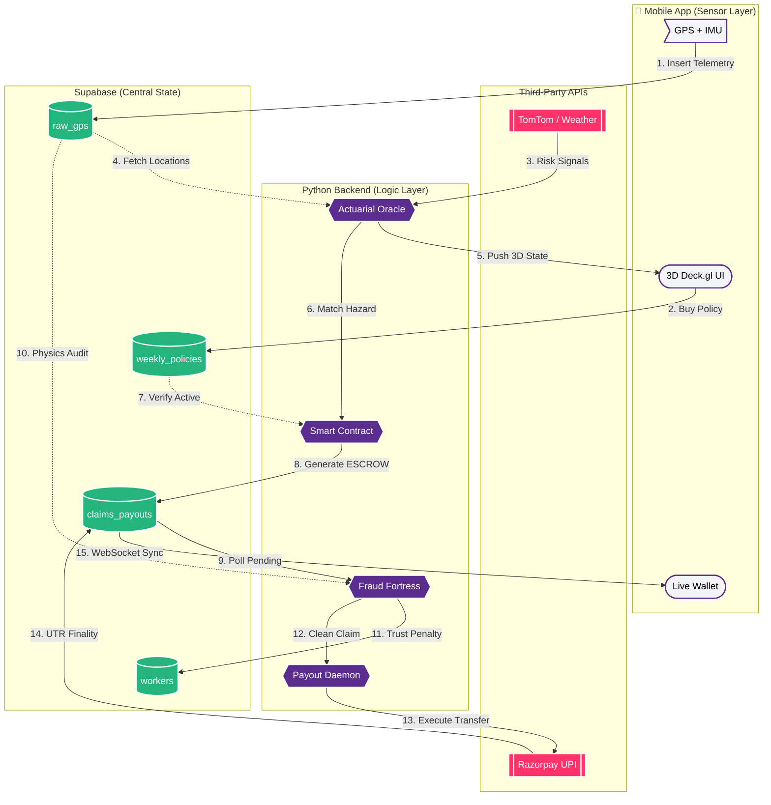

# WinkIt (Phase 2 Submission)
### *Providing instant blink-surance for the Gig Economy.*

🔗 **Quick Links:**
* **[Watch the Phase 2 Pitch & Live DB Sync Video](#)** *(Insert Link Here)*
* **[View our original Phase 1 Submission](PHASE1_README.md)**
* For a deep dive into our **Actuarial Math, Solvency Projections (ARR), and Python Daemon architectures**, please read our 17-page Technical Whitepaper- [Astrobugs- Technical and Mathematical Architecture-3.pdf](https://github.com/user-attachments/files/26480114/Astrobugs-.Technical.and.Mathematical.Architecture-3.pdf)

---
## FROM AN END USER'S PERSPECTIVE (The Rider's Journey)

To truly understand WinkIT, you have to look past the Python daemons and PostgreSQL ledgers, and view the platform from the seat of a delivery bike. That is why we are taking you through a journey starting right at the end user.

**Meet Rahul.** Rahul is a 24-year-old Zepto rider in Chennai. He relies entirely on his daily gig wages to pay rent. 

### 1. The Setup (Frictionless & Inclusive)
It’s Monday morning. Rahul opens the WinkIT app. Because his English isn't perfect, he toggles the app to **Tamil**. The UI instantly adapts natively, building immediate trust. He sees a weekly policy offered for just ₹45. He swipes to activate. His wallet is linked, and he starts his week of deliveries.

### 2. The Disruption (Situational Awareness)
It’s Thursday afternoon, and a sudden, severe monsoon hits Chennai. 
Rahul is 5 kilometers from home. He opens the WinkIT app and looks at the **3D Deck.gl Map**. He sees the grid around him shifting colors. The H3 Hex he is currently in turns flashing red. A notification pops up in Tamil: *"Severe waterlogging detected in your zone. Please find safe shelter."*

### 3. The Magic (Zero-Touch Adjudication)
Rahul takes shelter under a metro station overhang. The rain is blinding. In traditional insurance, Rahul would lose his wages for the day, and eventually, he’d have to fill out a 4-page PDF claim form in English and wait 30 days for an adjuster to review it.

**With WinkIT, Rahul does absolutely nothing.** He just waits out the storm safely.

### 4. The Payout (Instant Liquidity)
One hour later, while still sitting under the bridge, his phone buzzes. It’s a bank notification. 
**"₹80.00 credited to your account via Razorpay UPI."**

Because his phone's GPS and IMU sensors proved he was trapped in an active hazard zone, WinkIT's smart contract automatically authorized an hourly drip-feed payout. Rahul didn't file a claim. He didn't call support. The system simply knew he was in danger, verified his physics, and replaced his lost wages instantly.

---

### The Tech Behind the Magic
* **Why the app was in Tamil:** The Native L10n State Engine.
* **Why the map flashed red:** The Python Backend pushed an H3 state update based on TomTom Traffic and OpenWeather APIs.
* **Why he got paid without asking:** The Cron Oracle detected his GPS intersecting with the hazard hex.
* **Why he got the money instantly:** The Fraud Fortress verified his IMU didn't show "teleportation," and the Payout Daemon fired the UPI API.
---
> **Before you dive into the codebase, we want to highlight 16 deliberate engineering decisions we took to maximize platform resilience, solvency, and scale. These aren't just features; they are opinionated trade-offs.**

## 16 Executive Technical Decisions

### Architecture and Infrastructure

**1. The "Thin-Client" Mobile Architecture (Zero-Trust Frontend)**
* **What:** The Android app computes zero risk logic; it strictly fetches backend quotes and posts user actions. It is completely isolated from mathematical computation.
* **Why:** Prevents malicious riders from reverse-engineering the APK to manipulate their premiums or trigger fake payouts locally.

**2. Domain-Driven Database Design (Invoice vs. Receipt)**
* **What:** We rigidly separated data into `worker_charges` (dynamic quotes) and `weekly_policies` (active contracts).
* **Why:** Maintains a pristine financial audit trail by keeping unaccepted AI quotes completely separate from legally binding coverage liability.

**3. Geospatial Standardization via Uber’s H3 Index**
* **What:** All weather, traffic, and rider locations are mapped to standard H3 hexagonal grid strings instead of complex spatial polygons.
* **Why:** Makes database geospatial queries deterministic and lightning-fast at scale.

**4. The "Headless" Insurance Core (Ready for Phase 3)**
* **What:** The backend API and database logic are built completely agnostic of the Android frontend.
* **Why:** Ensures zero restructuring is required when we scale distribution to WhatsApp and Voice Chatbot integrations in the future.

**5. Asynchronous Server-Side Batching**
* **What:** All heavy API queries (weather, traffic) and risk computations execute asynchronously on our Python backend; the mobile app never pings external APIs directly.
* **Why:** Preserves the gig worker’s battery life and limited mobile data, ensuring the app runs lightning-fast even on low-end devices in 3G network zones.

---

### Financial and Actuarial Logic

**6. The "Cold-Start" Introductory Rate (Graceful Degradation)**
* **What:** New riders lacking historical telemetry data are automatically offered a flat introductory premium rate.
* **Why:** Solves the data-vacuum problem for new users while ensuring immediate onboarding conversions.

**7. Dynamic Risk Moratoriums (Adverse Selection Prevention)**
* **What:** The system algorithmically blocks the purchase of new policies in a specific H3 zone if a severe calamity is already actively ongoing.
* **Why:** Protects platform liquidity by preventing bad actors from buying insurance *only* after they realize they cannot work.

**8. Zero-Touch Parametric Adjudication (Killing OPEX)**
* **What:** Payouts trigger automatically when API data (weather/curfews) intersects with a rider's GPS location.
* **Why:** Eliminates the need for human claims adjusters, keeping operational costs near zero so micro-premiums remain highly profitable.

**9. Closed-Loop Financial Ledger (Unified Wallet Architecture)**
* **What:** Automated premium deductions, instant AI-triggered parametric payouts, and manual fallback claims all reconcile instantly within a single, centralized wallet ecosystem.
* **Why:** Eliminates accounting friction and settlement delays, ensuring workers experience immediate liquidity.

**10. Liquidity Mapping (The Micro-Premium Alignment)**
* **What:** Coverage is sold strictly in 7-day increments for micro-amounts (e.g., ₹45/week).
* **Why:** Perfectly matches the week-to-week cash flow reality of gig workers, removing the friction of expensive monthly subscriptions.

---

### Security, Trust & UX

**11. Strict Database-Level Constraints (Postgres Enums)**
* **What:** Status rules (e.g., ACTIVE, SUSPENDED) are locked securely at the Supabase PostgreSQL level.
* **Why:** Guarantees data integrity if the Python engine, Web Dashboard, or Mobile App accidentally sends conflicting payload data.

**12. Gamified Fraud Prevention (The Trust Score)**
* **What:** Suspicious behavior automatically lowers a rider's visible Trust Score, triggering higher future premiums.
* **Why:** Creates a self-regulating financial deterrent against fraud without requiring human investigators.

**13. State-Based Authorization (The Global Kill-Switch)**
* **What:** A single access boolean on the rider's database profile governs their entire platform usage.
* **Why:** Allows the automated fraud engine to instantly and universally lock out spoofing bots across all systems simultaneously.

**14. Multi-Language Inclusivity (The Trust Engine)**
* **What:** Built a custom localization state engine to serve the UI natively in English, Hindi, Kannada, and Tamil.
* **Why:** Builds brand trust and eliminates support tickets caused by gig workers misunderstanding English legal disclaimers.

**15. Event-Driven Risk Telemetry (Proactive Dashboarding)**
* **What:** The Python backend continuously monitors external disruption APIs and pushes real-time 3D risk state updates directly to the rider’s frontend.
* **Why:** Replaces passive insurance with proactive risk management, giving drivers instant situational awareness to navigate safely.

**16. Personalised Chatbot**
* **What:** A context-aware AI assistant built exclusively for WinkIT, designed to help riders understand risk, policies, and payouts in real time.
* **Why:** The chatbot turns WinkIT from an invisible backend system into a visible, trusted co-pilot for every rider.

---
# How the Entire System Works

WinkIT is a **fully autonomous, event-driven insurance system** designed for real-time risk coverage.

It operates as a **closed-loop ecosystem** where:

- The **mobile app acts as a sensor** - No computation here. (As mentioned in our executive decisions :) )
- The **backend acts as an underwriter**
- The **database acts as an immutable ledger**
- The system continuously **detects → verify → pay**

---

## System Architecture Overview

    Mobile App (Sensor Layer)
             ↓
    API + WebSockets
             ↓
    Backend Agents (Decision Layer)
             ↓
    Supabase (Ledger + State)
             ↓
    Payout Engine (Execution Layer)
             ↓
    Back to User (Real-time Updates)

---

## 1. Mobile App — The Sensor Layer

The Android app (Jetpack Compose) is not just a UI - **it is a high-fidelity data collection node.** To ensure financial integrity and prevent reverse-engineering, we implemented a "Thin-Client" (Zero-Trust) architecture where **the app performs zero mathematical or risk-based computation.**

### What it does:

- User onboarding (OTP + profile + UPI)
- Continuous GPS + sensor telemetry- for audit-grade verification.
- Real-time risk visualization (H3 hex grid)- "High Risk" zones and safe corridors in 3D
- Policy + wallet management- automated "Drip-Feed" payouts reconciled via the **Supabase ledger.**

### Key Concepts:

- Every location → converted into an **H3 hex ID**
- Live updates via **WebSockets**
- Secure auth via **JWT + device checks**
- No computation. It fetched everything from the middle-layer-> Supabase
- It is User Friendly with features like multi-language enabler



> Think of the app as:  
> **"A live sensor node feeding reality into the insurance engine"**

**What it computes:**
- Nothing. Zero math. It's a sensor.

**What it collects:**
- GPS coordinates (every 5 seconds)
- IMU variance (accelerometer/gyroscope)
- Device integrity (Play Integrity API, root detection)
- Mock location status

**What happens if fraud detected:**
- GPS pings marked as "is_flagged_fraud = true"
- Future claims from that device auto-rejected
- Trust Score automatically penalized

---

## 2. Backend — The Autonomous Underwriter

This is where WinkIT separates itself from traditional InsurTech. We replaced human claims adjusters with **deterministic, asynchronous Python daemons.**

### Core Idea:
No humans. No manual claims.  
Only **data → decisions → execution**

---

### A. Risk Detection Engine

Runs asynchronously every **60 minutes**.

* **Inputs:** OpenWeather APIs, TomTom Traffic APIs, Local RSS / News Feeds.
* **Process:** 1. Agentic LLM analyzes the unstructured situation.
  2. Assigns Risk Category, Base Score, and extracts the affected H3 Hex epicenter.
  3. **Reality Check Layer** validates the LLM assumption against physical traffic data.

> **Result:** Prevents hallucinations and ensures actuarial safety.

#### LLM Underwriter (Why Cerebras + Llama 3.1?)
We utilize LLMs for risk categorization because unstructured civic data (news, Twitter) cannot be parsed by traditional APIs.

```text
Why it works (Example Scenario):
├─ Input: "Flooding reported in Velachery + traffic at 15% + rain 85%"
├─ Output: {category: "ARTERIAL_BLOCKAGE", confidence: 0.92, duration: "4hrs"}
└─ Benefit: 10x cheaper inference than GPT-4, delivering instant structuration.

Safety Layer (Preventing Hallucinations):
├─ Physical validation tier overrides the LLM if physics disagree.
├─ If LLM says "TOTAL SHUTDOWN" but TomTom Traffic is flowing at 40% speed...
└─ OVERRIDE: Risk downgraded to 0.0. Ensures we never over-commit financially.
```


#### Why H3 Hexagons (Not Just Lat/Lng)?
Traditional geofencing relies on comparing raw floating-point coordinates (e.g., 12.9716°N vs 12.9710°N), which leads to boundary inconsistencies and false negatives.

Example Hallucination & Override:
LLM Output: "TOTAL_SHUTDOWN (Risk 4.5)"
TomTom Reality: "Arterial roads at 40% flow"
System Decision: Downgrade to ARTERIAL_BLOCKAGE (Risk 2.5)
Premium Charged: ₹40 instead of ₹48
Result: Actuarially sound


* **The WinkIT Solution:** Convert both rider and disaster zones into Uber's H3 spatial indexes (e.g., `88419551d5dffff`).
* **The Result:** Deterministic, O(1) string-matching. Zero disputes about *"were you really in the zone?"*

---

### B. Dynamic Pricing Engine

To ensure we never breach the Guidewire constraint of ₹50/week, we abandoned linear pricing and implemented an Asymptotic Pricing Curve.

* **Base:** All premiums start at a ₹20 floor.
* **Risk Multiplier:** Adjusted 0.6x → 2.4x based on real-time hazard data.
* **Formula:** $Premium = 49 \times (1 - e^{-x})$ (where $x$ is the risk score).

**Examples:**
```text
├─ No disruptions: ₹20 (0.4x multiplier)
├─ Light rain: ₹28 (0.7x multiplier)  
├─ Flooding: ₹45 (1.5x multiplier)
└─ Total shutdown: ₹48 (2.4x multiplier, capped)
```

**Why this works:** Workers get cheaper insurance on safe days (low risk), but we never charge more than ~₹50 on dangerous days (high risk), successfully honoring the affordability floor.

---

### C. Smart Contract Trigger Engine

Runs every **30 seconds**.

**What it does:**
1. Finds active disruptions.
2. Matches workers in affected H3 zones.
3. Checks if the user holds an `ACTIVE` policy.
4. Calculates the authorized payout.

---

### D. Drip-Feed Payout Model

Instead of lump sum payouts: Weekly Premium → Split into hourly payouts
Example:
- ₹45/week → ₹0.268/hour  
- Adjusted by risk multiplier  

### Why it matters:
Prevents system collapse. If the flood clears after 2 hours, the payout halts, rescuing the remaining capital. Reduces fraud incentive and strictly limits Maximum Probable Loss (MPL).

---

## 3. Fraud Fortress — Trust Layer

Every payout is securely verified using a combination of **real-world physics + device integrity**. 

### Multi-Layer Checks

* **Device Security:** Enforces mock location detection, root/jailbreak detection, and Google Play Integrity API validation.
* **Physics Validation:** Cross-references speed against IMU (accelerometer/gyroscope) movement and ensures continuous GPS presence while moving.
* **GNSS Authenticity:** Analyzes satellite signal noise patterns to instantly detect and neutralize GPS spoofing attempts.

---

### Verdict Outcomes

* ✅ **CLEAN** → Payout instantly approved.
* ⏳ **PENDING** → Wait for secondary validation.
* ❌ **FRAUD** → Claim rejected and flagged.

---

## 4. Supabase — The Financial Brain

Supabase provides our enterprise-grade PostgreSQL backbone. It acts as the central nervous system, a real-time event bus, and an immutable financial ledger.


Rather than treating the database as just a storage layer, we utilize `PostgreSQL Enums`, `constraints`, and `Row Level Security (RLS)` to enforce our smart contract logic at the database level.

### 🗄️ The Complete Schema Breakdown

To maintain strict domain isolation and a pristine audit trail, the database is normalized across three distinct operational layers:

#### I. Core Entities & Policy Management
* **`workers`:** The master user table. Stores demographic data, delivery platform IDs (Blinkit/Zepto), and the dynamic **Trust Score** used to penalize fraudulent behavior.
* **`worker_charges` (The Invoice):** Stores temporary, high-frequency quotes generated by the Asymptotic Pricing Engine.
* **`weekly_policies` (The Receipt):** Stores legally binding, active coverage contracts. Separated from `charges` to ensure clean financial auditing.
* **`worker_daily_activity`:** Aggregates daily operational metrics like active hours and deliveries completed, establishing a baseline for expected loss calculations.

#### II. Telemetry & Environmental Oracles
* **`raw_gps_telemetry`:** A high-throughput table ingesting thousands of pings per second. Stores `speed_kmh`, `imu_variance`, and satellite noise data.This table is the primary hunting ground for the **Fraud Fortress**.
* **`weather`:** Stores 5-day PoP (Probability of Precipitation) forecasts pulled in 3-hour blocks from the OpenWeather API.
* **`disruption_events`:** Logs active civic hazards (e.g., `TOTAL_SHUTDOWN`, `ARTERIAL_BLOCKAGE`) classified by the Cerebras Llama 3.1 Underwriter.
* **`h3_zone_states`:** The persistent memory for our spatial grid. Tracks infrastructure health and standing water levels, allowing hexes to undergo "V-Zone Healing" dynamically across cron cycles.


#### III. The Escrow & Settlement Ledger
* **`claims_and_payouts`:** The most critical table in the platform. It safely holds smart contract claims generated by the Drip-Feed engine in a rigid **ESCROW state**. Only after passing the Fraud Fortress does a record transition to `AUTO_PAID` with a Razorpay UTR.
* **`relocation_events`:** Tracks surge bonuses and safe-routing directives pushed to the rider's UI during active hazards.
* **`manual_claims`:** The fallback mechanism for edge-case disruptions not caught by the parametric oracle, ensuring zero coverage gaps for the worker.


### The ESCROW Mechanism (State Integrity)

Every parametric payout undergoes a strict, unidirectional state machine flow locked by the database:
`ESCROW` ➔ `PENDING_AUDIT` ➔ `APPROVED` ➔ `AUTO_PAID`

**Guarantees:**
* **Idempotency:** A unique cryptographic hash (`WorkerID` + `UTC_Hour`) ensures the cron job cannot accidentally double-pay a worker for the same hour of a disruption.
* **Financial Safety:** Capital is committed but never physically moved until algorithmic physics validation completes.

---

## 5. Payout Engine — The Execution Layer

Runs every **30 Seconds**

Parametric insurance is useless if the rider has to wait weeks for the capital to clear. WinkIT closes the loop by settling verified claims directly to the rider's bank account in seconds, with zero human intervention.

> **The FinTech Flex:** The payout engine (`payout_worker.py`) is completely decoupled from the Risk Oracle. By separating the *decision to pay* from the *execution of payment*, we eliminate race conditions and ensure strict financial idempotency.

---
## 6. Winklytics — The Actuarial Command Center

If the Python Backend is the brain and Supabase is the ledger, **Winklytics** is the eye in the sky. Built with Vite, this is our internal operational dashboard designed for the aggregator's risk management team. 

> **The Actuarial Flex:** We don't just process claims blindly. Winklytics provides real-time portfolio solvency monitoring, ensuring the platform never scales to bankruptcy.

### Core Dashboard Features:
* **Global H3 Telemetry:** A live, macro-view of all active riders across the city, mapped against real-time weather and civic hazard hexes.
* **Live Burning Cost Rate (BCR):** Continuously calculates our net claim exposure relative to premium liquidity. 
* **The 85% Circuit Breaker:** If a catastrophic event pushes the portfolio BCR past 85%, Winklytics automatically suspends new policy enrollments in the affected H3 zones to protect the capital pool.
* **Fraud Fortress Feed:** A live, scrolling feed of rejected claims. It details the exact physics vector (e.g., *GNSS Spoofing*, *IMU Teleportation*) that triggered the rejection and tracks the automatic deductions to the rider's Trust Score.
* **Capital Protection Metrics:** Tracks the "Liquidity Saved" delta—showing investors exactly how much capital was preserved by using our hourly Drip-Feed Escrow model instead of traditional lump-sum payouts.

##### **NOTE**- The authentication and some buttons are mock but the data is being pulled real time from supabase. The complete lifecycle will be implemented in Phase-3
---

### The Execution Flow (The "Last Mile")
Running as an isolated, asynchronous daemon on DigitalOcean every 30 seconds, the Payout Worker handles the final mile of the transaction.

1. **Queue Polling:** The daemon continuously listens to the Supabase `claims_and_payouts` table, looking strictly for records that have survived the Fraud Fortress and hold an `APPROVED` status.
2. **Idempotency Lock:** Before executing, the script verifies the `claim_id` hash. If a network timeout previously occurred, this guarantees the worker is **never double-paid** for the same event.
3. **Gateway Injection:** The daemon formats the verified payload and fires a server-side API call to the **Razorpay UPI Gateway**.
4. **Ledger Finality:** Upon receiving the HTTP 200 Success callback from Razorpay, the system extracts the **UTR (Unique Transaction Reference)** number.
5. **State Closure:** The Supabase ledger is permanently updated to `AUTO_PAID`, and the UTR is logged. The mobile app's WebSocket listener detects this state change and instantly refreshes the rider's UI wallet.

---

### The Payment Architecture



---
##  COMPLETE End-to-End Lifecycle

This is the exact chronological lifecycle of a WinkIT policy, executing from purchase to payout in a fully autonomous loop.

- **1.  Policy Inception:** User purchases a dynamic, 7-day policy via the App.
- **2.  Hazard Detection:** Backend Oracles detect a severe disruption (e.g., Flooding).
- **3.  Risk Mapping:** The AI classifies the risk and maps it to specific **H3 Hexes**.
- **4.  Spatial Intersection:** The rider's GPS telemetry intersects with the active hazard zone.
- **5.  Smart Contract Trigger:** The engine automatically drip-feeds the hourly payout rate into **ESCROW**.
- **6.  Fraud Gauntlet:** The Fraud Fortress audits the rider's IMU and GNSS data for spoofing.
- **7.  Instant Settlement:** The payout is cleared and routed through the **Razorpay UPI Gateway**.
- **8.  Ledger Finality:** The UTR is recorded, and the rider's wallet updates instantly.

---

###  System Architecture: How It Inter-relates

The diagram below maps the complete data flow across our four distinct operational layers: The Mobile Client, the Immutable Ledger, the Python Brain, and External APIs. 


--- 
## Directory Structure
```
.
├── config.py
├── engine
│   └── dynamic_pricing
│       └── pricing_engine.py
├── fraud_evaluator.py
├── frontend
│   ├── app
│   │   ├── build
│   │   ├── build.gradle.kts
│   │   ├── proguard-rules.pro
│   │   └── src
│   ├── build.gradle.kts
│   ├── gradle
│   │   ├── libs.versions.toml
│   │   └── wrapper
│   ├── gradlew
│   ├── gradlew.bat
│   └── settings.gradle.kts
├── payment-backend
├── payout_worker.py
├── Phase1_README.md
├── README.md
├── requirements.txt
├── services
│   ├── civic_risk_agent.py
│   └── weather_api_client.py
├── trigger.py
├── WinkIt
└── winklytics
    ├── index.html
    ├── README.md
    ├── src
    │   ├── App.jsx
    │   ├── components
    │   ├── index.css
    │   ├── lib
    │   ├── main.jsx
    │   └── supabase.js
    ├── vite.config.js
```
---
## Live Implementation & Testing Guide

Want to see WinkIT in action? Here is how judges and evaluators can interact with our Phase 2 deployment across all four layers of the stack.

### 1. Winklytics Command Center (Web)
Our operational dashboard is deployed and live.
* **Live URL:** [https://winkitlytics.vercel.app/](https://winkitlytics.vercel.app/)
* **Evaluator Note:** To remove friction for the judging panel, the **authentication layer is currently mocked**. You can bypass login to immediately view the dashboard. However, please note that all maps, risk metrics, and the Fraud Fortress feed are pulling **real-time, live data** directly from our Supabase ledger.

### 2. WinkIT Rider App (Android)
To test the sensor layer and UI, you have two options:

**Option A: Quick Test (Recommended)**
* Download the `app-debug.apk` directly from our **[GitHub Releases](#)** page and install it on your Android device.

**Option B: Build from Source**
If you wish to evaluate the Kotlin architecture:
1. Clone the repository: `git clone https://github.com/dagaayush1205/Winkit`
2. Open the project in **Android Studio** (Ladybug or newer recommended). Open the `frontend` folder.
3. Create or open the `local.properties` file in the root directory and append your environment variables:
   ```properties
    OPENWEATHER_API_KEY="your openweather api key"
    SUPABASE_URL="your supabase url"
    SUPABASE_ANON_KEY="your supabase anon key"
    GEMINI_API_KEY="your gemini api key"
   ```
   **NOTE**- Since we are unable to share supabase url and key, we would love for you to use your own key, if needed, set up the database using this doc-
   
5. Sync the Gradle project.
6. **Crucial Setup Note:** Please deploy the application to a Physical Android Device rather than a desktop emulator. The WinkIT Fraud Fortress strictly requires authentic IMU variance and GPS telemetry; an emulator will trigger a "Mock Location / Spoofing" rejection state!

### 3. Autonomous Python Backend
Our core actuaries, LLM pipelines, and payout daemons are currently deployed and running natively on a DigitalOcean Droplet.

    Security Protocol: Following zero-trust security best practices, we cannot publicly expose our Droplet IP address or SSH credentials to protect our production database keys and financial API secrets.

    Live Verification: To verify the backend execution, please watch our Live Backend Execution Video. In this video, we SSH into the server, trigger a simulated monsoon event, and show the live terminal logs of the daemons matching H3 hexes, generating ESCROW claims, and executing the Razorpay UPI transfers.

### 4. Supabase Ledger
Our PostgreSQL database is live and fully integrated. You do not need to run this locally. Any policy purchase made on the Android App, or any payout executed by the Python Backend, will reflect instantaneously on the Vercel Winklytics dashboard via real-time WebSocket syncing.

---

## Phase 1 to Phase 2 Evolution (Addressing Domain Gaps)

In Phase 1, our parametric prototype proved technical viability. However, feedback highlighted a critical gap in traditional insurance domain knowledge regarding capital adequacy and coverage boundaries. For Phase 2, we rebuilt the underlying actuarial foundation.

**Key Evolutions:**
* **Strict Actuarial Exclusions:** The pricing engine now explicitly restricts coverage parameters. The smart contract will immediately halt execution in the event of Force Majeure occurrences, explicitly excluding **Acts of War, Pandemics, and Terrorism**. These are uninsurable systemic risks that mandate government intervention, not micro-insurance capital.
* **Guidewire Core Alignment:** The architecture now mimics a Guidewire InsuranceSuite deployment. The Python backend acts as an autonomous `PolicyCenter` (underwriting) and `ClaimCenter` (adjudication), completely isolating the core financial ledger from the frontend portal.
* **Solvency Modeling:** We transitioned from theoretical pricing to strict Burning Cost Rate (BCR) modeling to prove long-term portfolio capital adequacy.

---

## Competitive Moat (Why We Win)

Traditional insurers and digital-first disruptors cannot easily replicate the WinkIT architecture. Our sustainable advantage is a compounding 18-month lead built on hardware security, physics, and data.

| Feature | Traditional / Competitors | WinkIT (Parametric) | The Defensible Moat |
| :--- | :--- | :--- | :--- |
| **Fraud Detection** | Subjective human adjusters | **Physics + Device Integrity** | Requires deep kernel-level Android engineering & physics domain expertise (18+ months to rebuild). |
| **Payout Model** | Lump-sum (Solvency risk) | **Hourly Drip-Feed** | Mathematically proven solvency. Competitors require retraining entire claims departments. |
| **Risk Detection** | Manual risk categorization | **H3 + LLM Validation** | Requires vast unstructured data pipelines and physical traffic APIs (Data moat). |
| **Cash Flow Alignment**| Monthly subscriptions | **7-Day Micro-Cycles** | Perfectly aligned with gig worker weekly payouts. Competitors must restructure their entire ledger to match. |
| **Execution** | OPEX-heavy processing | **Zero-Touch API Payouts** | Requires extreme regulatory trust in automation (Trust moat). |

---

---

### System Deep-Dive: Infrastructure Overhead & Resource Utilization

We designed WinkIT to operate with **extremely low infrastructure overhead**, proving that parametric micro-insurance can be executed at scale without bloated enterprise servers. By utilizing a headless, event-driven architecture and offloading state management to Supabase, our compute footprint remains minimal even during active claim cycles.

**Performance Baselines (As Tested):**
To validate our unit economics and OPEX models, we monitored the backend Python daemons during standard execution and stress-test cycles. 

* **Compute (CPU):** Idles at **~5%**, peaking at only **28%** during concurrent H3 coordinate matching and Razorpay API execution.
* **Memory (RAM):** Sustained memory footprint of approximately **400 MB** (steady at 40% utilization), ensuring we can comfortably run multiple containerized oracles on a basic tier virtual machine (e.g., a $5/mo DigitalOcean droplet).
* **Storage/Disk:** Negligible disk I/O. Disk usage remained flat at **~12%** with zero bloat. The backend acts as a stateless conduit, routing decisions directly to the PostgreSQL ledger and purging raw GPS telemetry instantly to comply with data privacy standards.

**Telemetry Snapshots:**
Below are the live resource utilization graphs captured during our deployment, confirming the sustainable, ultra-low operational cost of the WinkIT engine:


---

## The Tech Stack

WinkIT is built on a modern, decoupled stack designed for scale and security:

* **Frontend (Sensor):** Android (Kotlin, Jetpack Compose), Deck.gl (3D Maps).
* **Backend (Brain):** Python 3.10, FastAPI, DigitalOcean Droplets.
* **Database (Ledger):** Supabase (PostgreSQL, Edge Functions, Realtime WebSockets).
* **AI & Oracles:** Cerebras Inference (Llama 3.1 8B), OpenWeather API, TomTom Traffic API.
* **FinTech & Auth:** Razorpay (UPI Payouts), JWT, Play Integrity API.
* **Command Center:** Vite, React, TailwindCSS, Vercel.

---
## Future Scope (Phase 3 Roadmap)

We didn't just build for this hackathon; our architecture is designed to scale into a fully operational InsurTech entity.

* **(Distribution):** Launching the **WinkIT WhatsApp Bot**. Because our backend is completely "headless" (Decision #4), we can trigger the exact same smart contracts and UPI payouts via WhatsApp messages for riders who don't want to install an app.
* **(Regulatory Sandbox):** Official submission to the **IRDAI Regulatory Sandbox** to begin live beta testing. We shall dockerise this in the next phase.

And we add some spice :)
---
